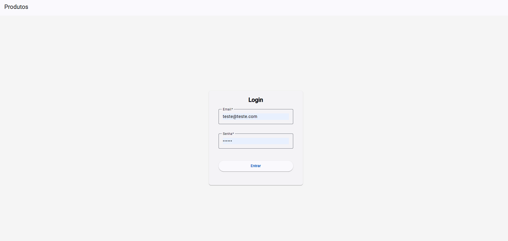
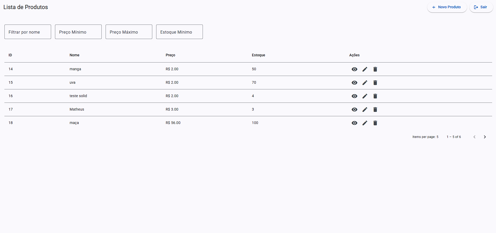

# 📌 README - Ambiente do Projeto (Laravel + Angular + Material Design)

## 🚀 Requisitos
Antes de iniciar, certifique-se de ter instalado:
- [Docker](https://docs.docker.com/get-docker/)
- [Docker Compose](https://docs.docker.com/compose/install/)

---

## 🐳 Subindo o ambiente com Docker

### 1. Clone o repositório
```bash
git clone https://github.com/matheusrods/produtos-laravel-first-decision.git
cd seu-projeto
```

### 2. Configure o arquivo `.env`
Copie o arquivo de exemplo:
```bash
cp backend/.env.example backend/.env
```

Ajuste as variáveis de ambiente do **Laravel**:
```env
APP_NAME=Laravel
APP_ENV=local
APP_KEY=
APP_DEBUG=true
APP_URL=http://localhost

LOG_CHANNEL=stack
LOG_LEVEL=debug

DB_CONNECTION=mysql
DB_HOST=db
DB_PORT=3306
DB_DATABASE=laravel
DB_USERNAME=laravel
DB_PASSWORD=secret

SESSION_DRIVER=database
```

> ⚠️ Note que `DB_HOST=db` corresponde ao nome do serviço do banco de dados no `docker-compose`.

---

### 3. Suba os containers
Entre na pasta `/docker` e rode o comando:
```bash
docker-compose up -d --build
```

Isso irá criar:
- **php** → rodando Laravel (`php-fpm`)
- **nginx** → servidor web para servir o Laravel
- **db** → MySQL
- **angular** → servidor frontend (**Angular + Angular Material Design**)

---

### 4. Configuração do Laravel
Acesse o container do PHP:
```bash
docker exec -it php bash
```

Execute os comandos:
```bash
composer install
php artisan key:generate
php artisan migrate --seed
```

> 🔑 Um usuário padrão será criado:
```
Email: teste@teste.com
Senha: 123456
```
Faça login em [http://localhost:4200/login](http://localhost:4200/login) com esses dados.

---

### 5. Configuração do Angular
O container já sobe com o comando:
```bash
npm install && ng serve --host 0.0.0.0 --port 4200 --poll 2000
```

Ou seja, você não precisa rodar manualmente `npm install` ou `npm run build`.  
O projeto já estará acessível em [http://localhost:4200](http://localhost:4200).

> 🖌️ O frontend já vem configurado com **Angular Material Design**, utilizando seus componentes (botões, formulários, tabelas, etc.) para a interface.

---

## 🌐 Acessando o projeto
- **Backend (Laravel)** → [http://localhost](http://localhost)  
- **Frontend (Angular + Material Design)** → [http://localhost:4200](http://localhost:4200)  
- **Swagger UI (API Docs)** → [http://localhost/api/documentation](http://localhost/api/documentation)  

---

## 📖 Documentação da API (Swagger UI)

A API está documentada com **Swagger UI** via `l5-swagger`.

- Acesse a interface web:
  ```
  http://localhost/api/documentation
  ```

- Para regenerar a documentação:
  ```bash
  docker exec -it php bash
  php artisan l5-swagger:generate
  ```

- Os **schemas** estão definidos em:
  ```
  app/Virtual/Schemas
  ```

- Configurações adicionais em:
  ```
  config/l5-swagger.php
  ```

---

## 📂 Estrutura do projeto
```
/backend     -> Código Laravel (PHP)
/frontend    -> Código Angular com Material Design
/docker      -> Configurações do Docker
```

---

## 🔧 Comandos úteis
- Subir os containers:
  ```bash
  cd docker
  docker-compose up -d
  ```
- Derrubar os containers:
  ```bash
  docker-compose down
  ```
- Acessar container Laravel (PHP):
  ```bash
  docker exec -it php bash
  ```
- Acessar container Angular:
  ```bash
  docker exec -it angular bash
  ```

---

## ✅ Checklist pós-instalação
1. Rodar `composer install` e `php artisan key:generate` no Laravel.
2. Criar tabelas e usuário com `php artisan migrate --seed`.
3. Angular já sobe automaticamente com **Material Design**.
4. Testar acessando:
   - `http://localhost`
   - `http://localhost:4200`
   - `http://localhost/api/documentation`

   ---

## 🖼️ Demonstração do Sistema

### 🔑 Tela de Login


### 📦 Tela de Produtos


---
